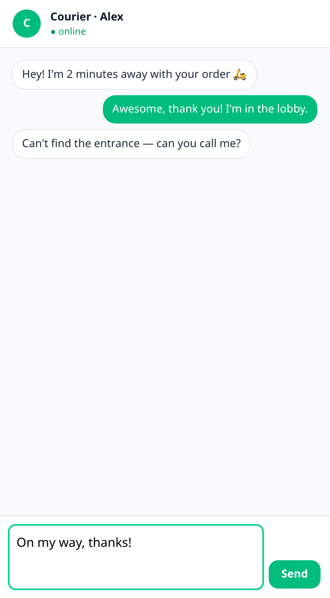
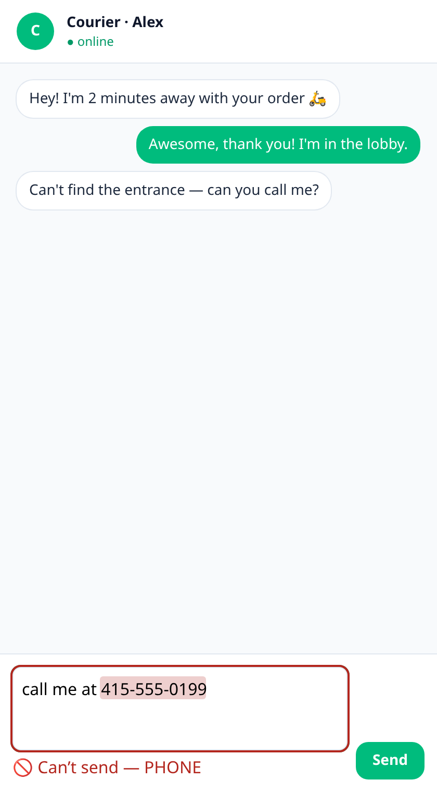
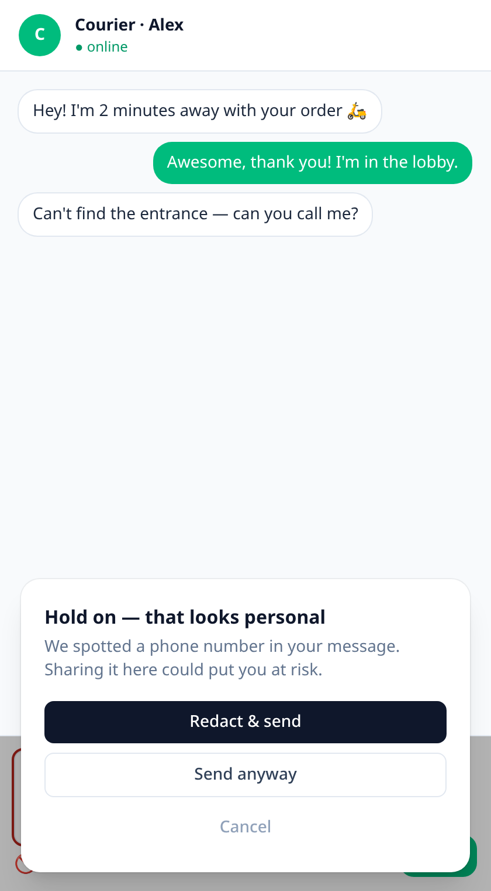
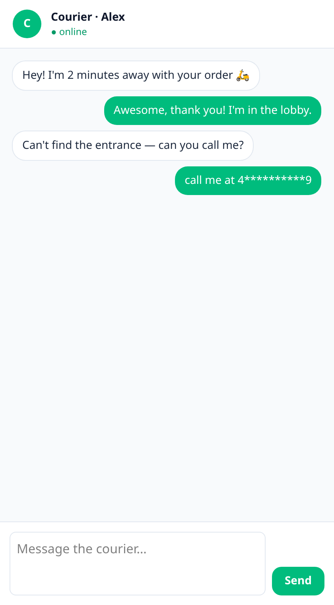

<div align="center">

# 🛡️ FELA Moderator

### The submit-time content gate that keeps PII & toxicity off your backend.

[](https://github.com/Lowdown-Labs/fela_moderator/actions/workflows/ci.yml)
[](https://scorecard.dev/viewer/?uri=github.com/Lowdown-Labs/fela_moderator)
[](https://www.npmjs.com/package/@lowdown/moderate)
[](./LICENSES.md)
[](https://docs.npmjs.com/generating-provenance-statements)

**One install. Two knobs. Zero data leaves the device.** 📵

`pii` and `toxicity`, each `block · warn · off` — default **block**. So nothing you don't want
to hold ever reaches your server. Runs client-side on 📱 React Native, 🌐 web, and 🟢 Node — fully offline.

[](https://stackblitz.com/github/Lowdown-Labs/fela_moderator?file=demo/chat/src/App.tsx)

`npm i @lowdown/moderate` &nbsp;·&nbsp; 🪶 13 MB model &nbsp;·&nbsp; ⚡ ~22 ms/check &nbsp;·&nbsp; 🎯 0.977 AUROC &nbsp;·&nbsp; 🔒 on-device

</div>

---

## 👀 See it in action

A courier chat 🛵 — type a phone number and watch it **highlight inline**, **gate the Send button**,
and pop *your own* dialog: **Redact & send / Send anyway / Cancel**.

| ✅ Clean | 🖍️ Highlighted | 💬 Your dialog | 🥷 Redacted |
|:---:|:---:|:---:|:---:|
|  |  |  |  |

> 🏃 **Run it locally:** `npm --prefix demo/chat install && npm --prefix demo/chat run dev`

---

## 🧩 Use it — pick your layer

Enter at whatever layer fits your brain. Each one is the escape hatch for the one above. 🪜

### 1️⃣ Drop-in component — blocks both by default (the mission default)
```tsx
import { ModeratedTextarea } from "@lowdown/moderate/react";

<ModeratedTextarea onBlocked={() => setCanSend(false)} onClean={() => setCanSend(true)} />
```

### 2️⃣ Soften a knob — one line, no per-entity config 🎛️
```tsx
<ModeratedTextarea policy={{ pii: "warn", toxicity: "block" }} />
```

### 3️⃣ Wire in your own dialog — return a decision from *any* UI 💬
```tsx
const ref = useRef<ModeratedTextareaHandle>(null);

<ModeratedTextarea ref={ref} onFlagged={async (findings) => await myDialog(findings)} />;
// on send: const d = await ref.current.guardSubmit();  // → "send" | "redact" | "block"
```

### 4️⃣ Headless hook — build the whole thing yourself 🔧
```tsx
const { findings, blocked, redact, guardSubmit } = useModeration(text, { policy });
```

### 5️⃣ Own the component — eject the source & restyle freely (shadcn-style) 📦
```bash
npx @lowdown/moderate add moderated-textarea
```

### 🌍 No framework? Plain HTML5 custom element, no build step
```html
<script type="module" src="fela-moderated-input.js"></script>
<fela-moderated-input placeholder="Say something…"></fela-moderated-input>
<script type="module">
  el.addEventListener("flagged", (e) => myDialog(e.detail.findings).then(e.detail.decide));
</script>
```

### 🧠 Backend / anywhere — just the function
```js
import { check } from "@lowdown/moderate";
if (check(text).blocked) return reject("contains PII or obscenity");
```

---

## 🎨 Make it yours (theming)

Three ways, no CSS-in-JS lock-in:

- 🖌️ **CSS custom props** — `--fela-block`, `--fela-warn`, `--fela-radius`. One line to rebrand.
- 🧬 **`::part()` + `data-*`** — `part="input | banner | finding"`, `data-severity`, `data-category`.
- 🧵 **`classNames={{ root, input, banner }}` slots** — bring your Tailwind / shadcn utilities.

> In `add` / eject mode the component ships **unstyled** and inherits your design tokens automatically. ✨

---

## ⚙️ How it works (hybrid + explainable)

```
             ┌─────────────── normalize(text) ───────────────┐
  raw text → │  NFKC + un-homoglyph (+ offset map to original) │
             └───────────────────────┬────────────────────────┘
             materiality gate:  raw ≡ normalized?  ── no ─┐
                     │ yes                                 │  (obfuscated)
                     ▼                                     ▼
        ┌── detectors (raw) ──┐             ┌── detectors (raw ∪ normalized) ──┐
        │ validator.js · phone │            │  spans mapped back to ORIGINAL    │
        │ ipaddr · presidio    │            └───────────────────┬───────────────┘
        │ obscenity · naughty  │                                │
        │ spam heuristics      │        FELA byte-model (RAW) ──┤
        └──────────┬───────────┘         toxicity · PII · …     │
                   └───────────────┬──────────────────────────┘
                                   ▼
                      merge: union · PII dedupe (prefer validated rule span)
                             · corroboration boost · head enable-flags
                                   ▼
                         ModerationResult { flagged, categories,
                           piiSpans, reasons[], normalizedText }
```

**Explainable by default.** Every flag carries a structured `Reason` —
`{ source, detector, label, span, matched, score, language }` — pointing at your *original* text (even
when the hit was found on the normalized form). `explain(result)` renders them in plain English:

```js
import { moderate, explain } from "@lowdown/moderate";

const result = moderate("mail joe@example.com and Ⅴ1@gⓡ@");
explain(result);
// "Flagged EMAIL (rule, 1.00) via validator.email 'joe@example.com' at chars 5–20; …"
```

| Concern | Handled by | Why |
|---|---|---|
| 📇 Structured PII — email, phone, card, IP, SSN, IBAN, crypto | **MIT rule detectors** (validator.js, google-libphonenumber, ipaddr.js, Presidio-style regex) | deterministic, validated, exact spans |
| 🌐 Obfuscation — homoglyphs, full-width, circled, leetspeak | **normalize() + substitution-aware matching** | canonicalized before rules & model |
| 🤬 Profanity / slurs (multilingual) | **obscenity + leo-profanity + naughty-words** | non-English handled deterministically |
| 🧠 Toxicity + unstructured PII (names/addresses) | **FELA byte-model** | nuance/semantics a wordlist can't do |

New model heads (spam, jailbreak, NSFW-severity, target-identity) are pre-registered and ship **disabled
until they pass our eval gate** — flip one flag to enable, no code change.

---

## 🔌 If you love Zod / Valibot / ArkType / validator.js…

Moderation becomes **one rule** in the validation you already run — web or React Native, no server. We
implement [Standard Schema](https://standardschema.dev), so the same adapter drops into Zod, Valibot,
and ArkType (zero extra dependency):

```ts
import { z } from "zod";
import { moderationSchema, zodRefine } from "@lowdown/moderate/schema";

// Standard Schema — works with Zod / Valibot / ArkType and @hookform/resolvers
const Message = z.object({ body: z.string() }).and(z.custom(v => moderationSchema()["~standard"].validate(v)));

// …or a Zod refinement, if you're already deep in Zod:
const Body = z.string().superRefine(zodRefine({ /* policy/config */ }));
```

The rejected field's error message **is** the structured reason — the "why" flows straight into your
existing error UI. (Under the hood we already validate structured PII *with* validator.js, so if that's
your tool, you're covered too.)

---

## 📊 Numbers (measured, not vibes)

- 🪶 **13 MB** int8 model — 3.4× smaller than fp32, accuracy-preserving.
- 🎯 **macro-AUROC 0.977** on 15k of the official Jigsaw scored test (int8; fp32/card agree at 0.9775/0.9773).
- ⚡ **~22 ms / 512-byte window** on an x86 dev box (a phone is ~3–8× slower — still fine per-submit).
- 🧮 **~200× less compute per check** than a 3B on-device LLM's forward pass (6.75 GMACs vs ~1.5 TMACs).

---

## ⏱️ What you pay (measured, per gate)

Regenerate any time with `npm run bench`. The normalization gate means **plain text pays almost nothing**
— the second detector pass only runs when the input is actually obfuscated.

| Stage | p50 | p95 |
|---|---|---|
| `normalize()` | 0.007 ms | 0.0123 ms |
| validator.js | 0.0018 ms | 0.0038 ms |
| google-libphonenumber | 0.0111 ms | 0.0236 ms |
| ipaddr.js | 0.0011 ms | 0.0022 ms |
| Presidio regex | 0.0009 ms | 0.0014 ms |
| obscenity + leo | 0.023 ms | 0.0445 ms |
| naughty-words (multilingual) | 0.0098 ms | 0.0106 ms |
| spam heuristics | 0.0038 ms | 0.0048 ms |
| **`moderate()` end-to-end (model off)** | **0.1289 ms** | **0.1559 ms** |

Any tool that costs more than its signal is worth can be shipped disabled via the head registry
(`config.heads`) — the SDK stays lean and fast.

---

## 🗂️ What's in the box

- `reference/moderate.mjs` — byte-encode, byte↔UTF-16 offset mapping, PII spans, redaction, toxicity.
- `reference/checkers.mjs` — FOSS structured-PII regex/validators.
- `reference/validate.mjs` — the `check()` gate. `validate.test.mjs` → `node validate.test.mjs` (all pass ✅).
- `react/useModeration.ts` — the headless hook. `react/ModeratedTextarea.tsx` — the styled component.
- `web/fela-moderated-input.js` — the zero-build custom element.
- `bin/moderate.mjs` — the `moderate add` CLI (eject a component into your repo).
- `demo/chat/` — the polished Vite + Tailwind courier-chat demo (source of the screenshots above 📸).
- `SPEC.md` — the full on-device inference + windowing + redaction spec.

---

## 🤝 Honesty

Toxicity is strong and license-cleaner (Jigsaw CC0 + permissive sources). **PII precision is
approximate** on free-form text — the model's byte-BIO boundaries are ragged (int8 == fp32, so it's the
tiny model, not quantization). Great for a *gate* (recall of "is there PII?"), rough for precise
extraction — which is exactly why structured PII is regex. ⚠️ The PII head's training data (ai4privacy)
is non-commercial-gated — **retrain PII on a permissive source before commercial release.**

All added detector dependencies are MIT/permissive (see `LICENSES.md`); multilingual word lists are
CC-BY-4.0 (attributed there). No network calls — text never leaves the device.

## 🔒 Quality & trust

Every push and PR runs the full suite on **Linux · macOS · Windows** across **Node 18/20/22**, plus
ESLint + Prettier, a typecheck, `publint` + `size-limit`, `npm audit`, and a **Semgrep OSS** scan. New
dependencies are auto-checked against an **MIT/permissive license allowlist**. An **OpenSSF Scorecard**
runs weekly, Dependabot keeps deps fresh, and releases publish with **npm provenance**. Found a security
issue? See [`SECURITY.md`](.github/SECURITY.md). Want to contribute? See
[`CONTRIBUTING.md`](CONTRIBUTING.md).

<div align="center">

Made with 🛡️ by **Lowdown Labs** · keep your users' secrets secret.

</div>
