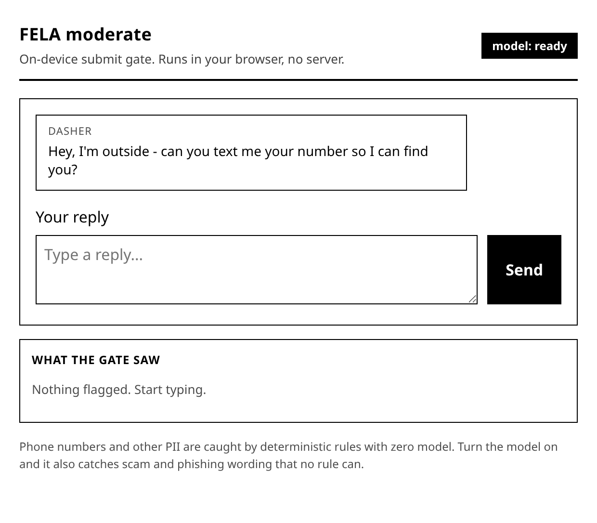
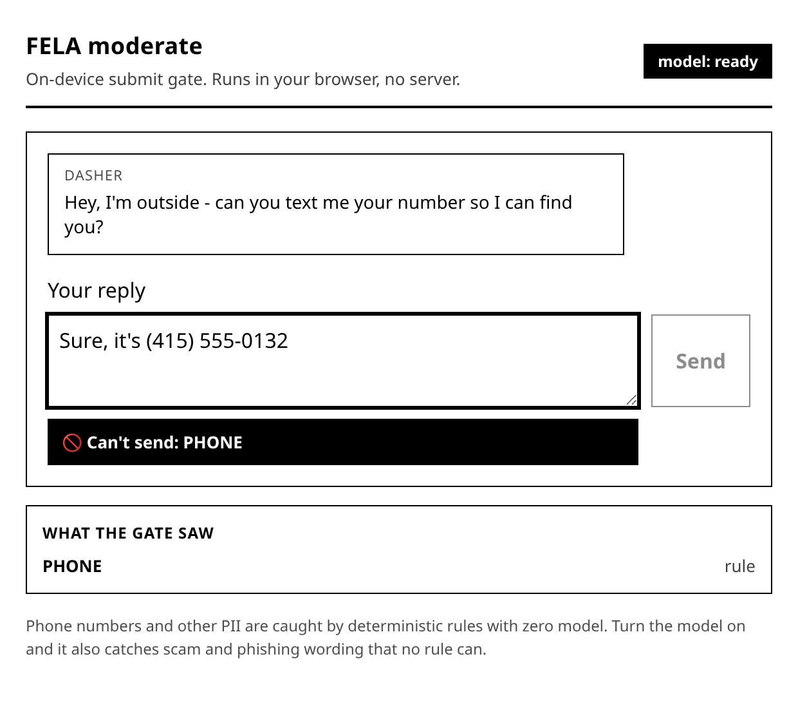
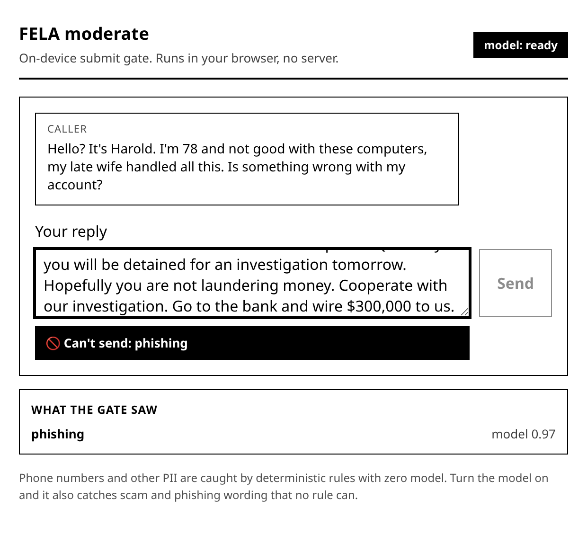

<div align="center">

# FELA Moderator

## The "blood brain barrier" to your backend systems.

[](https://www.npmjs.com/package/@lowdown-labs/moderate)
[](https://github.com/Lowdown-Labs/fela_moderator/actions/workflows/ci.yml)
[](./LICENSES.md)
[](package.json)
[](#quality-and-trust)

**One install, convention over configuration, private fast and on device.**

For instance - set a simple configuration for `pii` and `toxicity` each to `block`, `warn`, or `off`. 
The default is `block`, so nothing you do not want to hold ever reaches your server. 
It runs in the browser, in Node, and in React Native, fully offline.

`npm i @lowdown-labs/moderate`. About 17-22 MB int8 model (depending on format), runs on a plain CPU, nothing leaves the device.

</div>

---

# What it detects and filters

**Personal information (PII).** Email addresses, URLs, phone numbers, credit card numbers (Luhn
checked), and IP addresses (v4 and v6). Government and financial ids: SSN, IBAN, BIC, and Bitcoin and
Ethereum wallet addresses. Plus free form PII from the model: names, street addresses, and similar
unstructured identifiers.

**Toxicity.** The six Jigsaw categories: toxic, severe toxic, obscene, threat, insult, and identity hate.

**Profanity and slurs.** English profanity, including character substitution and leetspeak, and
multilingual slur lists covering Spanish, Portuguese, French, German, Italian, Russian, and Arabic.

**Spam and scams.** URL shorteners and common scam phrases from configurable lists, plus a model spam
head for spam, scam, and phishing.

**Obfuscation.** Homoglyphs, full width and circled characters, and leetspeak are normalized first, so
everything above still fires on disguised text, and every span still points at your original text.

Every hit is traceable as it carries the source, the detector, the matched text, and a span into your
original string wherever possible.

---

# See it in action

[](https://stackblitz.com/github/Lowdown-Labs/fela_moderator)

A courier asks for a phone number, the reply is flagged and blocked before it can send, all in the browser.

**Rule detectors, no model needed.** The phone number is caught deterministically by the built in detectors, so the Send button could lock even without our efficient AI model loaded.

| Clean | Blocked |
| --- | --- |
|  |  |

**Model on.** With the optional on device model loaded, the neural spam and phishing head could catch a scammer's elder fraud wire message, scoring it phishing at 0.97, and blocks it from ever reaching the target. Harold never sees it, all in the browser with no server.



Run it yourself in `examples/playground`.

---

# Use it at your choice of abstraction level

Interface at whatever layer fits the job. Each one is an escape hatch to the layer beneath it.

## 1. Drop in component, blocks all by default
```tsx
import { ModeratedTextarea } from "@lowdown-labs/moderate/react";

<ModeratedTextarea onBlocked={() => setCanSend(false)} onClean={() => setCanSend(true)} />
```

## 2. Relax a filter, one line, no complex configs
```tsx
<ModeratedTextarea policy={{ pii: "warn", toxicity: "block" }} />
```

## 3. Wire in your own dialog, return a decision from any UI
```tsx
const ref = useRef<ModeratedTextareaHandle>(null);

<ModeratedTextarea ref={ref} onFlagged={async (findings) => await myDialog(findings)} />;
```

## 4. Headless hook, build the whole thing yourself
```tsx
const { findings, blocked, redact, guardSubmit } = useModeration(text, { policy });
```

## 5. Own the component, eject the source, and restyle freely
```bash
npx @lowdown-labs/moderate add moderated-textarea
```

## No framework? Plain HTML custom element, no build step
```html
<script type="module" src="fela-moderated-input.js"></script>
<fela-moderated-input placeholder="Say something"></fela-moderated-input>
<script type="module">
  el.addEventListener("flagged", (e) => myDialog(e.detail.findings).then(e.detail.decide));
</script>
```

## Backend or anywhere, just the function
```js
import { check } from "@lowdown-labs/moderate";
if (check(text).blocked) return reject("contains PII or obscenity");
```

---

# Make it yours

Three ways, with no "CSS in JS" lock in:

- CSS custom properties: `--fela-block`, `--fela-warn`, `--fela-radius`. One line to rebrand.
- `::part()` and `data-*`: `part="input | banner | finding"`, `data-severity`, `data-category`.
- `classNames={{ root, input, banner }}` slots: for which one could bring their Tailwind or shadcn utilities.

In eject mode the component ships unstyled and inherits your design tokens automatically.

---

# How it works

```
             +--------------- normalize(text) ----------------+
  raw text ->|  NFKC + unhomoglyph (+ offset map to original) |
             +-----------------------+-------------------------+
             materiality gate:  raw == normalized?  -- no --+
                     | yes                                  |  (obfuscated)
                     v                                      v
        +-- detectors (raw) --+            +-- detectors (raw + normalized) --+
        | validator.js, phone |            |  spans mapped back to ORIGINAL   |
        | ipaddr, presidio    |            +------------------+---------------+
        | obscenity, naughty  |                               |
        | spam heuristics     |         FELA byte model (RAW) +
        +----------+----------+          toxicity, PII, spam   |
                   +---------------+---------------------------+
                                   v
                     merge: union, PII dedupe (prefer validated rule span),
                            corroboration boost, head enable flags
                                   v
                        ModerationResult { flagged, categories,
                          piiSpans, reasons[], normalizedText }
```

Explainable by default. Every flag carries a structured `Reason` of
`{ source, detector, label, span, matched, score, language }` pointing at your original text, even when
the hit was found on the normalized form. `explain(result)` renders it in plain English:

```js
import { moderate, explain } from "@lowdown-labs/moderate";

const result = moderate("mail joe@example.com and V1@gr@");
explain(result);
// "Flagged EMAIL (rule, 1.00) via validator.email 'joe@example.com' at chars 5 to 20; ..."
```

| Moderation Concern | Handled by | Why |
|---|---|---|
| Structured PII: email, phone, card, IP, SSN, IBAN, crypto | MIT rule detectors (validator.js, google-libphonenumber, ipaddr.js, Presidio style regex) | deterministic, validated, exact spans |
| Obfuscation: homoglyphs, full width, circled, leetspeak | normalize() and substitution aware matching | canonicalized before rules and model |
| Profanity and slurs (multilingual) | obscenity, leo-profanity, naughty-words | non English handled deterministically |
| Toxicity, spam, and free form PII (names, addresses) | FELA byte model | nuance a wordlist cannot do |

The deterministic detectors and the model heads run together and merge into one result. Every head is a
flag in `config.heads`, so you can turn any of them off, and the spam head's thresholds live in
`config.head_thresholds`, tunable for your traffic, all without touching code.

---

# The model

A byte level, IE tokenizer free AI model built on a Fourier Neural Operator with gated linear attention. It reads raw UTF-8
bytes, so there is no vocabulary file to ship and it is not locked to one language (we hope to improve multi lingual performance soon!). 

The int8 export is about 17 - 22 MB depending on format; and runs on a plain CPU with no GPUs.
Because the encoder carries no KV cache and a fixed size state, working memory does not grow with input length - a property 
we are proud to demonstrate with our Lowdown Labs efficient AI models.

The SDK uses the three of its heads only, the ones that we feel confident shipping at launch (and will improve the others later):

- Toxicity: the six Jigsaw categories.
- Byte level PII across 56 entity types (113 BIO tags) with exact spans, for the free form names and
  addresses the regex detectors leave to the model.
- Spam: spam, scam, and phishing.

Model license. The model weights are covered by Apache-2.0, the same as the code (see
[`LICENSE`](LICENSE) and [`NOTICE`](NOTICE)): no separate model license, no non commercial restriction.
Every training source is permissively licensed and commercial safe: the PII head on nvidia/nemotron-pii
(CC-BY-4.0), gretelai/synthetic_pii_finance_multilingual (Apache-2.0), and synthetic Faker and Presidio
data (MIT); the toxicity heads on the Jigsaw labels (CC0) and Civil Comments (CC0). No non commercial
data is used anywhere. We distribute weights only, never the source text.

Training footprint: about two hours on a single CPU instance, **on the order of 0.05 kg CO2e**, a few
phone charges worth of energy, and millions of times less than training a frontier language model.

Held out accuracy:

| Head | AUROC or accuracy |
|---|---|
| PII (byte token accuracy) | 0.96 |
| toxicity (Jigsaw mean AUROC) | 0.94 |
| spam (mean AUROC) | 0.95 |

---

# If you love Zod, Valibot, ArkType, or validator.js

Moderation becomes one rule in the validation you already run, on the web or in React Native, with no
server. We implement [Standard Schema](https://standardschema.dev), so the same adapter drops into Zod,
Valibot, and ArkType with no extra dependency:

```ts
import { z } from "zod";
import { moderationSchema, zodRefine } from "@lowdown-labs/moderate/schema";

const Message = z.object({ body: z.string() }).and(z.custom((v) => moderationSchema()["~standard"].validate(v)));

const Body = z.string().superRefine(zodRefine());
```

The rejected field's error message is the structured reason, so the explanation flows straight into your
existing error UI. 

Under the hood we already validate structured PII with validator.js, so if that is
your tool of choice, you are covered too.

---

# Latency per gate

Regenerate any time with `npm run bench`. The normalization gate means plain text incurs almost no cost.
The second detector pass only runs when the input is actually obfuscated. 

These are the deterministic paths. The neural model is an optional async step you load once; when it is on, a full check adds one
pass over a fixed 512 byte window (c.f. he model rows below), so the latency penalty is roughly constant no matter how
long the input is.

| Stage | p50 | p95 |
|---|---|---|
| `normalize()` | 0.007 ms | 0.0123 ms |
| validator.js | 0.0018 ms | 0.0038 ms |
| google-libphonenumber | 0.0111 ms | 0.0236 ms |
| ipaddr.js | 0.0011 ms | 0.0022 ms |
| Presidio regex | 0.0009 ms | 0.0014 ms |
| obscenity and leo | 0.023 ms | 0.0445 ms |
| naughty-words (multilingual) | 0.0098 ms | 0.0106 ms |
| spam heuristics | 0.0038 ms | 0.0048 ms |
| **`moderate()` end to end (model off)** | **0.1289 ms** | **0.1559 ms** |
| **model on, multi core CPU** | **14 ms** | **40 ms** |
| **model on, single core (browser WASM)** | **66 ms** | **68 ms** |

The deterministic rows are sub millisecond, and even with the model on a full check stays below a
keystroke. Model rows are the int8 model via onnxruntime on an AMD Ryzen 7 7800X3D (multi core is the
default thread pool, single core is one thread, the rock bottom floor for browser WASM). 

The model head is optional and only runs when you enable it.

Any tool that costs more than you think it'd be worth can be shipped disabled through the head registry
(`config.heads`), so the SDK stays lean and fast.

---

# What is in the box

- `reference/moderate.mjs`: byte encode, byte to UTF-16 offset mapping, PII spans, redaction, toxicity.
- `reference/normalize.mjs` and `reference/detectors/`: normalization and the deterministic detectors.
- `reference/engine.mjs`: the `moderate()` pipeline. `reference/validate.mjs`: the `check()` gate.
- `reference/explain.mjs` and `reference/schema.mjs`: explanations and the validation adapters.
- `react/useModeration.ts`: the headless hook. `react/ModeratedTextarea.tsx`: the styled component.
- `web/fela-moderated-input.js`: the zero build custom element.
- `bin/moderate.mjs`: the `moderate add` CLI that ejects a component into your repo.

---

# Model Accuracy

Toxicity is strong, we feel it separates classes well. PII precision from the model is approximate on free form text, because its byte BIO
boundaries are ragged (int8 matches fp32, so it is the smallness of the model, not the quantization). It is a good
gate for "is there PII here", and rougher for precise extraction, which is exactly why structured PII is
handled by the deterministic detectors and hybridzed. Supervision is English centric, so non English accuracy for the
model heads is not established but we hope to improve this with some new training runs soon.

We only initially turned on what holds up on real traffic. All added detector dependencies are MIT or otherwise permissive (see
`LICENSES.md`); the multilingual word lists are CC-BY-4.0 at worst and attributed there. There are no network
calls. Text never leaves the device.

# Quality and trust

Every push and PR runs the full suite on Linux, macOS, and Windows across Node 18, 20, and 22, plus
ESLint and Prettier, a typecheck, `publint` and `size-limit`, `npm audit`, and a Semgrep OSS scan.
Dependabot keeps dependencies fresh, and the release workflow publishes with npm provenance. All runtime
dependencies are MIT or permissive (see [`LICENSES.md`](LICENSES.md)). Found a security issue? See
[`SECURITY.md`](.github/SECURITY.md).

<div align="center">

Made by Lowdown Labs. AI for Good. For Real.

</div>
